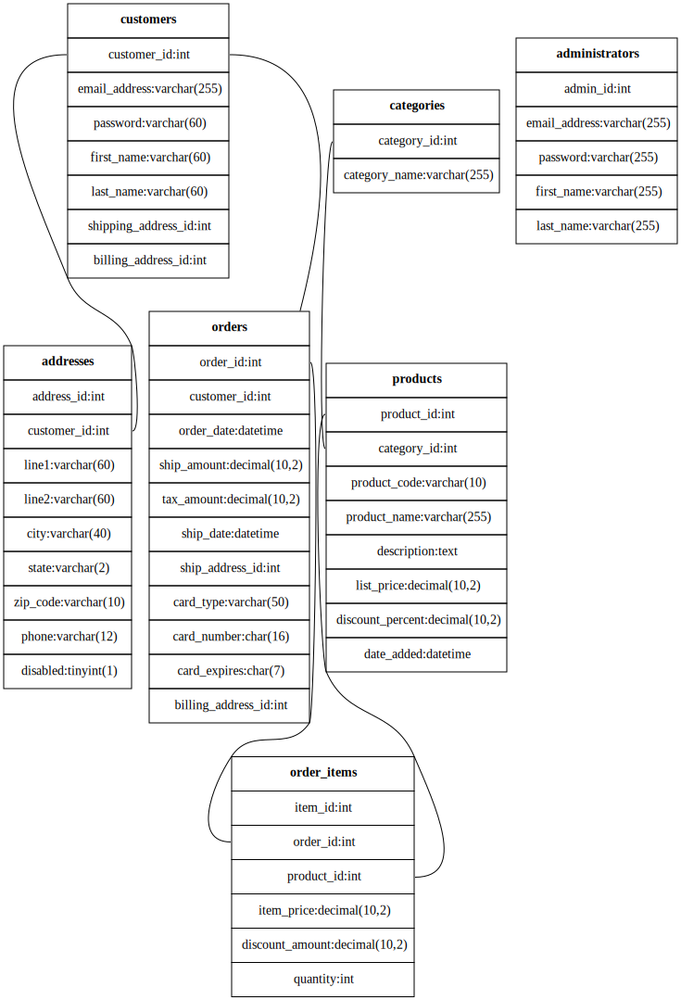

#Rust based ER model generator using graphviz

## CLI options
  <ol>
    <li>`-p` : port name -> defaults to 3306</li>
    <li>`-db` : databasename -> <h3>required</h3> for database name</li>
    <li>`-u`: user -> defaults to root</li>
  </ol>

Example

